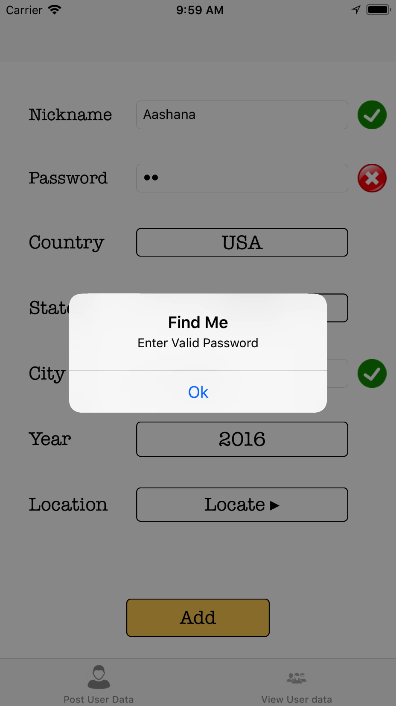
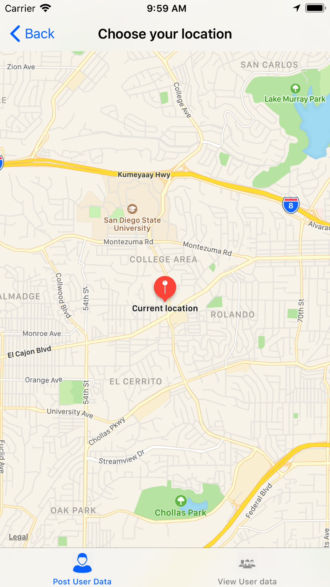
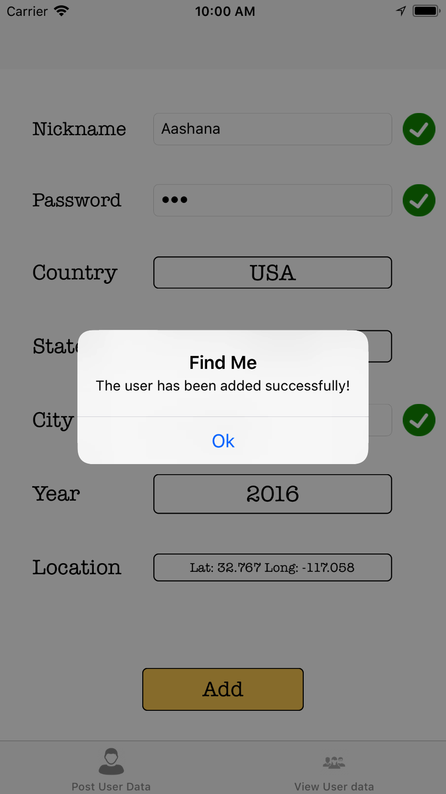
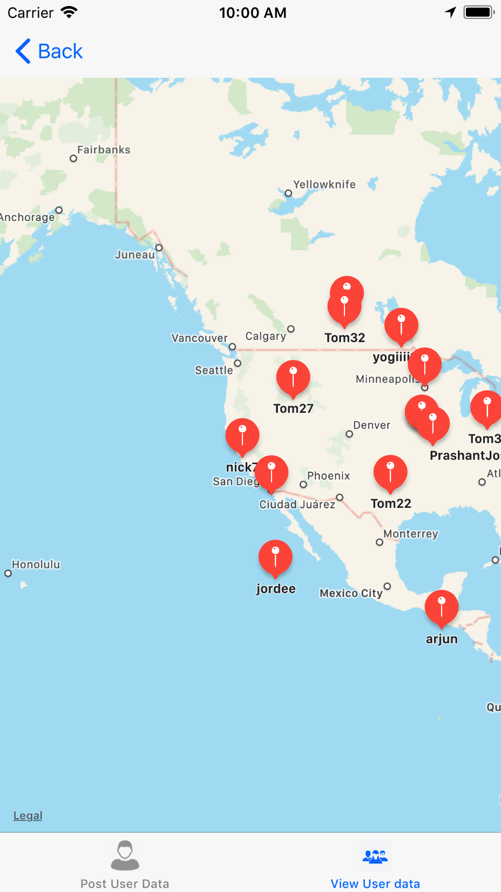

# Find-Me

Find your classmates swiftly !! This application allows your new classmates to enter their information, select their origin country and state, and locate themselves on a map. Voilà! you have got a detailed listing of all the students and their origins accessible to everyone in the college. You can use the globe view to view all the students on the map, also you can filter the students country-wise, state-wise and also according to their date of joining the college. This app makes it so easy to look for your first friends in a new environment. Happy searching !!

# Screenshots

 

 

 

 

 

 

 

 

 

 

# Requirements

- Xcode 9
- iOS 11
